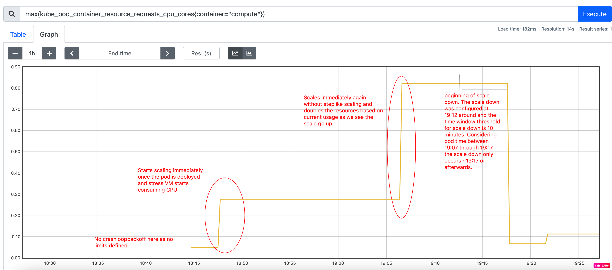

# Test Cases, Results and Analysis for VPA recommender

## Considerations
1. [Development Proposal document](https://github.com/kallurbsk/autoscaler/tree/vpa-recommender/vertical-pod-autoscaler/docs/proposals/crash_loop_handling)
2. [Code](https://github.com/kallurbsk/vpa-recommender/tree/vpa_v1)
3. [Stress Test tool used: [progrium/stress]](https://hub.docker.com/r/progrium/stress/) - The tool initiates a single worker spinning on malloc()/free() operation and max memory that can be used is set at 2048MB in this example. There is a one second interval between malloc() and free() operation defined
4. [Test Application Yaml](test_apps/stress_test_tool.yaml)
5. Test Cluster - kubernetes cluster on development landscape

## Unit Testing
- Unit test validating the new estimator algorithm which gives the CPU and memory scale
- Test evaluating setting CurrentCPUUsage, CurrentMemUsage, LocalMaximaCPUUsage, LocalMaximaMemUsage values in the Aggregate Container State object which is used to take care of state keeping the containers

## Functional Testing
1. Scale up recommendation to get pod state from `CrashLoopBackOff` (CLBO) to `Running` state. (compare)
2. Scale up recommendation if the current pod usage crosses threshold upper limit (compare)
3. Scale up recommendation stays intact and (if required scales up) even after recommender restart
4. Scale down recommendeation is applied if maximum of the current pod usage, local maxima within timeout window, goes below threshold lower limit (compare) and time out for scale down has surpassed.
5. Scale down recommendation is not applied if the maximum of the current pod usage, local maxima within timeout window, before threshold time out for scale down is not surpassed.
6. Recommender restart during scale down ensures scale down continues once recommender is back running
8. No scale recommendation if the pod usage is within threshold upper and lower limits
9. Recommendation sustains and does not scale resources even if recommender restarts, if pod usage is within threshold limits

**Note**: for tests having "compare", run it against old and new recommender to get a comparitive result for analysis

### Individual Test Steps
This paragraph talks about individual test steps required for running each of the test cases mentioned above

#### Scale Up Tests
1. Scale up recommendation to get pod state from `CrashLoopBackOff` (CLBO) to `Running` state. (compare)
- Test Steps
    1. Ensure the new vpa-recommender is running against the kubernetes cluster to be tested.
    2.	Define the VPA component resource for the application being tested. (Check stress_test_tool.yaml)
    3.	Once the application and VPA resource is applied, the application component starts off with an OOM Kill due to insufficient memory mentioned according to initial requests and limits.  There by goes into CrashLoopBackOff indicating a sudden choke in the memory and CPU usage.

- Expectation
    1. The VPA recommender should monitor the vpa component resource of this application and if applicable should start recommending.
    2. Considering that both CPU and memory are insufficient and the pod is already in CrashLoopBackOff state, the restart budget of the container should be calculated. If less than 0, then doubling of both CPU and memory based on current usage should be recommended as the resource to be applied for the application. (Restart Budget = Restart Budget – [CurrentRestartCount – LastSeenRestartCount])
    3. The pod should arrive back at Running state.

- Results Old VPA Recommender
    Please observe the results in between 14:05 to 14:18 in the below graphs obtained from Prometheus client.

    

    

    

- Results New VPA Recommender
    Please observe the results in between 2:30 to 2:40 in the below graphs obtained from Prometheus client.

    

    

    

- Analysis
    1. The CPU stays at the same config defined value once the pod has entered `CrashLoopBackoff` in the old vpa recommender. 
       In the new vpa recommender, we can see a gradual increase in CPU requests as the VPA starts recommending double the existing requests
       to get the pod out of crashloop state.
    2. The memory stays at the same config defined value once the pod has entered `CrashLoopBackoff` in the old vpa recommender. 
       In the new vpa recommender, we can see a gradual increase in memory requests as the VPA starts recommending double the existing requests
       to get the pod out of crashloop state.
    3. The restart count constantly increases in the old VPA recommender in comparison to the new vpa recommender.
    4. The old VPA recommender gives up recommendation and enters into below mentioned state.
        ```
        Update Policy:
        Resource Policy:
        Container Policies:
            Max Allowed:
            Cpu:     4
            Memory:  6Gi
            Name:      *
        Update Mode:   Auto
        Status:
        Conditions:
            Last Transition Time:  2021-06-15T08:33:55Z
            Status:                False
            Type:                  RecommendationProvided
        Recommendation:
        Events:  <none>
        ```
        The new VPA recommender on the other continues to provide recommendation as the logic there detects `CrashLoopBackOff` state of the pod
        and proceeds with doubling the CPU and memory resource till the pod stabilizes

2. Scale up recommendation if the current pod usage crosses threshold upper limit (compare)
- Test Steps
    1.	Ensure the new vpa-recommender is running against the kubernetes cluster to be tested.
    2.	Define the VPA component resource for the application being tested. (Check the yaml above)
    3.	Once the application is stable and in Running state, the VPA recommender should monitor the resource usage at the intervals of 1 minute.
    4.	Resource Request Upper Threshold Limit (RRUTL) is calculated respectively for both CPU and Memory. The threshold limit is set as a user
    defined parameter to the recommender binary. (Currently defaulted to 0.75)
- Expectation
    1.	If the resource usage goes beyond RRUTL, then the scale value for that resource should be doubled.
    2.	The pod restarts and applies the new resource requests calculated by the recommender accordingly.
    3.	The pod should stabilize and not run into CrashLoop

- Results Old VPA Recommender
    Please observe the results in between 14:35 and 15:05 in the below graphs obtained from Prometheus client.

    

    

    

    

    

    

- Results New VPA Recommender
    Please observe the results in between 2:35 and 3:00 in the below graphs obtained from Prometheus client.

    

    

    

- Analysis
    1. The old vpa recommender in this cases was enabled again with lower limits for the pod just to get it working.
       There was no change in configuration for the stress tool pod defined in the new vpa recommender case.
    2. The old vpa recommender observes a constant increase in the CPU recommendation which goes upto 70 millicores.
       This value is close the 50 millicore request defined initially and should there be a spike the pod enters into crash loop.
       The new VPA recommender on the other hand as a constant icnrease in the memory recommendation which goes upto 110 millicore
       which is double the value of 50 millicore request defined initially. The pod can be guarded for CPU spikes till 110 millicores
    3. The old vpa recommender observes a constant increase in the memory recommendation as we observe from the graph.
       It reaches at around 700MB and flattens while the pod usage is at around 512MB.
       The new VPA recommender doubles the memory recommendation based on the current usage and does not take history into account.
       It reaches a recommendation of around 1.2GB which is rouhgly double the value of 512MB. This also ensures a good limit
       for the pod should there be a sudden spike till about 1.2GB.
    4. We can observe the increase of resource of CPU from 150 millicore to 280 millicore nearly and memory increase of 1.2GB to 2.5GB
       in the new VPA recommender

3. Scale up recommendation stays intact and (if required scales up) even after recommender restart
- Test Steps
    1.	Ensure the new vpa-recommender is running against the kubernetes cluster to be tested.
    2.	Define the VPA component resource for the application being tested. (Check the yaml above)
    3.	Once the application is stable and in Running state, the VPA recommender should monitor the resource usage at the intervals of 1 minute.
    4.	Resource Request Upper Threshold Limit (RRUTL) is calculated respectively for both CPU and Memory. The threshold limit is set as a user
    defined parameter to the recommender binary. (Currently defaulted to 0.75)
    5.  Initiate a restart of the VPA recommender. Observe the VPA recommender comes back up post restart and starts detecting the VPA selectors

- Expectation
    1. The VPA recommendation given till now should stay intact.
    2. If there is no change in pod resource usage while the VPA is down, the pod should remain in running state.
    3. Once the VPA recommender is up, it should detect the VPA resource defined and VPA objects on the cluster using corresponding selectors.
    4. The restarted VPA should continue to recommend should there be a requirement based on the usage pattern.

- Results New VPA Recommender
    Please observe the results in between 2:35 and 2:45 in the below graphs obtained from Prometheus client.

    

    

    

- Analysis
    1. The recommender once restarted has preserved the state of the current recommendations given.
    2. This ensures to check if the pod usage has grown beyond the current recommendation and scale up depending on usage.
    3. We can observe the trend of increasing slightly in between 2:35 through 2:38 and there after that stays intact based on usage.


#### Scale Down Tests
1. Scale down recommendation is applied if maximum of the current pod usage, local maxima within timeout window, goes below threshold lower limit (compare) and time out for scale down has surpassed.
- Test Steps
    1.	Ensure the new vpa-recommender is running against the kubernetes cluster to be tested.
    2.	Define the VPA component resource for the application being tested. (Check the yaml above)
    3.	Once the application is stable and in Running state, the VPA recommender should monitor the resource usage at the intervals of 1 minute.
    4.	Resource Request Lower Threshold Limit (RRLTL) is calculated respectively for both CPU and Memory. The threshold limit is set as a user defined parameter to the recommender binary. (Currently defaulted to 0.3)
    5.	Set the ScaleDownSafetyMargin, a user defined parameter to indicate what times the usage should the pod scale down. Currently defaulted to 1.2

- Expectation
    1.	If the resource usage goes below RRLTL, then the scale value for that resource should be reduced to ScaleDownSafetyLimit.
    2.  The pod restarts and applies the new resource requests calculated by the recommender accordingly.

- Results Old VPA Recommender
    Please observe the results in between 14:35 and 15:05 in the below graphs obtained from Prometheus client.

    

    

    

    

    

    

- Results New VPA Recommender
    Please observe the results in between 3:02 and 3:20 in the below graphs obtained from Prometheus client.

    

    

    

- Analysis
    1. Previously a scale up from 512MB to 1GB was done in both experiments before initiating a scale down from 1GB to 256MB.
       Scale down time window interval in the new VPA recommender was set at 10 minutes. This ensures scale down does not happen
       immediately which might result in flapping should there be a usage spike immediately. The parameter is configurable by 
       the user and set to 30 minutes.
    2. The old vpa recommender stays at the recommendation of 1GB resource usage even after downgrading to 256MB. 
       I waited for ~30 minutes before stopping the recommender as the resource requests obtained from recommendation 
       for memory and CPU remained at the recommended values obtained previously for 1GB.
       The new VPA recommender on the other hand is slightly more predictable w.r.t scale down. The new VPA recommender scales down
       post the threshold scale down wait time window. In this experiment the scale down from 1GB usage to 256MB was initiated at
       3:02. The scale down however occurs only past 3:12 roughly. Ensuring it waits for the scale down time window before really scaling 
       down for the new usage value.
    3. As CPU was not varied separately in both the experiments here, it is in accordance with the scale occurring w.r.t memory usage.

2. Recommender restart during scale down ensures scale down continues once recommender is back running
- Test Steps
    1.	Ensure the new vpa-recommender is running against the kubernetes cluster to be tested.
    2.	Define the VPA component resource for the application being tested.
    3.	Once the application is stable and in Running state, the VPA recommender should monitor the resource usage at the intervals of 1 minute.
    4.	Resource Request Lower Threshold Limit (RRLTL) is calculated respectively for both CPU and Memory. The threshold limit is set as a user
    defined parameter to the recommender binary. (Currently defaulted to 0.3)
    5.  Initiate a restart of the VPA recommender. Observe the VPA recommender comes back up post restart and starts detecting the VPA selectors

- Expectation
    1. The VPA recommendation given till now should stay intact.
    2. If there is no change in pod resource usage while the VPA is down, the pod should remain in running state.
    3. Once the VPA recommender is up, it should detect the VPA resource defined and VPA objects on the cluster using corresponding selectors.
    4. The restarted VPA should continue to recommend should there be a requirement based on the usage pattern.

- Results of New VPA Recommender
    Please observe the results in between 3:02 and 3:10 in the below graphs obtained from Prometheus client.

    

    

    

- Analysis
    1. The recommender once restarted has preserved the state of the current recommendations given.
    2. This ensures to check if the pod usage has gone below the current recommendation and scale down depending on usage after scale down time 
       window interval passes.
    3. We can observe the scale down occurs post a restart of recommender and completion of scale down time window interval at around 3:12.

#### No Scale Tests
1. No scale recommendation if the pod usage is within threshold upper and lower limits
- Test Steps
    1.  Ensure the new vpa-recommender is running against the kubernetes cluster to be tested.
    2.	Define the VPA component resource for the application being tested.
    3.	Once the application is stable and in Running state, the VPA recommender should monitor the resource usage at the intervals of 1 minute.

- Expectation
    1.  If the VPA recommender finds that the resource usage is within the upper threshold limit and lower threshold limit, there should be no recommendation.

- Results of New VPA Recommender
    Please observe the results in between 2:38 and 2:48 in the below graphs obtained from Prometheus client.

    

    

    

- Analysis

2. Recommendation sustains and does not scale resources even if recommender restarts, if pod usage is within threshold limits
- Test Steps
    1.  Ensure the new vpa-recommender is running against the kubernetes cluster to be tested.
    2.	Define the VPA component resource for the application being tested.
    3.	Once the application is stable and in Running state, the VPA recommender should monitor the resource usage at the intervals of 1 minute.
    4.  Restart the VPA recommender when there is no new recommendation because the pod resource usage is within threshold limits

- Expectation
    1.  If the VPA recommender finds that the resource usage is within the upper threshold limit and lower threshold limit, there should be no recommendation.
    2. Once after restart, the VPA recommender should detect the pod and VPA resource attached to it. There should be no recommendation going forward too if the pod resource usage continues to stay in the same threshold limits.

- Results of New VPA Recommender
    Please observe the results in between 2:42 and 2:48 in the below graphs obtained from Prometheus client.

    

    

    
- Analysis

### Non-Functional Tests

1. Scale up test without defining limits in the initial pod configuration with VPA resource defined
- Test Steps
    1.	Delete the limits of the pod and also VPA component completely from the stress test yaml.
    2.	Apply the pod configuration on the cluster and check if it runs with it.
    3.	Check if the pod is running fine till the current max limit defined for the stress tool 2048MB is reached.
    4.	Keep increasing the memory ask in multiples of 2. (2048, 4096, 8192 MB)

- Expectation
    1.	If the resource consumption limit for pods are not reached for a particular node, the VPA recommender starts recommending based on existing requests. It should get the pod to running state. If still post that it fails, then the pod goes into Crash loop.

- Results of New VPA Recommender
    Please observe the results for the entire experiment of scale up initially from defined requests and usage of 512MB to 1GB, later scale down the usage to 256MB.

    

    

    

    

    

    

    

- Analysis
    1. We do not see a `CrashLoopBackOff` state initially as the limits for the pod was not defined and the pod sustains the usage.
    2. Once the VPA is applied based on usage it doubles the value of CPU and memory in one single jump.
    3. The no scale sustains for the component across the threshold time window.
    4. The scale down occurs independently for CPU and memory as the local maxima for them are contacted separately.
        1. Local Maxima is calculated for a given window period and the window keeps moving by the value determined (in this case 10 mins)
            Example: If there is a better local maxima say at 8th minute, the window now starts again from this time instance and adds 
            10 minutes to it before scale down can occur, should there be a lower usage. This happens separately for CPU and memory as local maxima for CPU and memory are calculate separately.
        3. So once the scale down occurs at around 19:12, the remaining time for CPU to enter into scale down was 5 minutes and for memory was 8 minutes.
        4. Hence one can observe, a CPU scale down happens at 19:17 around while the memory scale down happens at 19:22 around.
        5. The `Pod Information` graph above shows the pod restart at 19:17 and 19:22 clearly. Once both CPU and memory are scaled down, we can see the pod remains in that state with new usage values.

### Automation Plans
1. The old VPA recommender already has a set of functional test suites for integration and e2e testing.
2. The plan for the new VPA recommender is to check if we can reuse the same utilities of those tests as the overall behaviour remains same.
3. The above tests are done manually as of now and the automation can be completed in 2 phases.
    1. P0 test cases:
        1. All functional test cases are treated P0s and automation code completion with result gathering on local systems can be completed in 2 weeks.
    2. P1 test cases:
        1. All non-functional test cases are treated as P1s and automation plan with result gathering on local systems can be completed in 1 week.
4. The priority of picking the test cases is to get P0 cases working and only then pick P1 considering we only have a single test case.